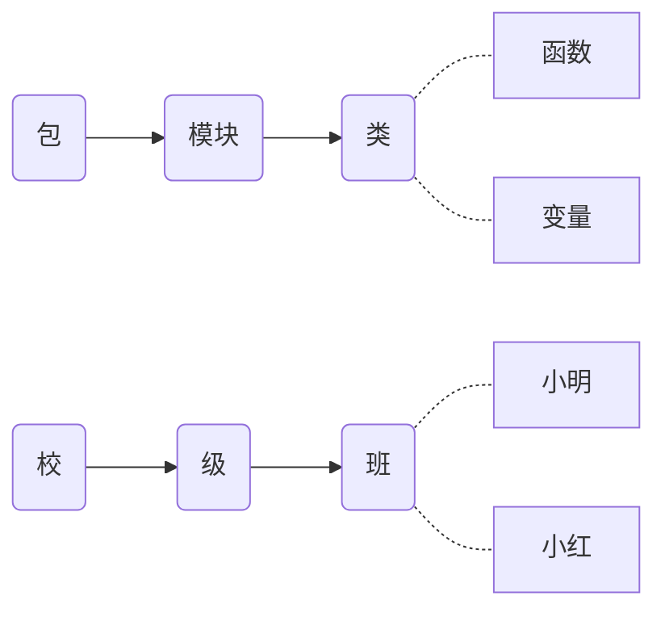
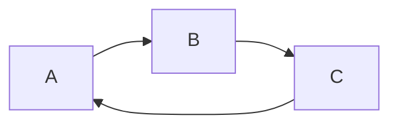

7.1 包、模块、函数与变量作用域

目录 

[toc]

---

# 一、python中的组织结构：包、模块、类

## 1.1 组织结构


**（1）类比：**
包-->文件夹
模块-->文件

**（2）包与普通的文件夹的区别**
包：里必须有个`__init__.py`文件。也就是将共用的、重复的东西放进这一个模块中

**2.包与模块的名字**

对于相同名字的模块，为了区分，前面加上包的名字。比如：
`six.c4.py`
`seven.c4.py`


# 二、关于模块与变量的导入

## 2.1 import导入模块

**1.方法**

```py
import module_name   #只能是模块（名）
```
**2.例题：**
**（1）模块c7和模块c8在同一个级**


```py
seven/c7.py
a = 2

seven/c8.py 
import c7    #只能是模块
print(c7.a)-->2   #要想调用c7模块下的变量a，就必须是模块名.变量名的形式

```
**（2）模块c7和模块c8不在同一个级**


```py
seven/t/c7.py
a = 2

seven/c8.py 
import c7   #因为在c8中运行，跟c8平级的是t
print(c7.a)-->错误❌
```
```py
seven/t/c7.py
a = 2

seven/c8.py 
import t.c7   #所以c7在这个t包下，要加上这个 t
print(t.c7.a)-->2 
```

**（3）当所调用的模块路径过长时，很不方便。如何简化？**
```py
seven/t/c7.py
a = 2

seven/c8.py 
import t.c7 as m # 将路径简化为一个字母
print(m.a)-->2 
```
**3.优缺点**
优点：一眼就能看出变量a所在的包和模块位置
缺点：命名空间过长，即使简化 ，也还是有一个黑点。

>关于不同语言的解析顺序
python：是解释型语言。其解析顺序必须是先定义后使用
其他编译型语言：可以先使用，后定义


## 2.2 from import导入变量

**1.方法**

```py
from module import a/def   #后面必须是一个具体的变量/函数
```
**2.例题：**

**（1）模块c7和模块c8不在同一个级，另一种导入的方法：**
```py
seven/t/c7.py
a = 2

seven/c8.py 
from t.c7 import a
print(a) -->2
```

**（2）当要导入不只一个变量时：**

```py
seven/t/c7.py
a = 2
b = 3
c = 4

seven/c8.py 
from t.c7 import *   #把模块中所有的变量都导入
print(a)

-->
2
3
4 
```
星号的缺点：引入不明确。能不用，就不用

**（3）导入多个变量时，有选择性的导入：**

```py
seven/t/c7.py
__all__ = ['a','b']  #使用模块内置变量__all__  #给该变量赋值，即只导出a,b两个变量
a = 2
b = 3
c = 4

seven/c8.py 
from t.c7 import *   #把模块中所有的变量都导入
print(a)

-->
2
3
error：c是未定义的 
```
**3.技巧**
**(1)关于__pycache__文件夹 / xx.pyc文件**

- 用途：自动生成的二进制自解码文件，用于提升运行效率
- 对开发者没有意义，关于隐藏：
文件/首选项/设置：搜索files.exclude，添加**/__pycache__即可
- 证明只隐藏没删除：在资源管理器中查看显示


**(2)一次性导入多个变量的简洁方式：**
```py
seven/t/c7.py
a = 2
b = 3
c = 4

seven/c8.py 
from t.c7 import a,b,c   #直接想导入什么，就写什么
print(a)

-->
2
3
4 
```
**(3)当导入的变量非常多，需要换行时直接换行会出错:**

```py
写法1：
from c9 import a,b,c,d,\   #加个反斜杠  #比较丑、突兀
e,f,g,h

写法2:
from c9 import (a,b,c,d,e,  #加个小括号：内括性、连接性
f,g,h)   
```


# 三、__init__.py的作用

该模块是自己手动建立的，做一些包和模块的初始化工作

## 3.1 导入包时，会首先自动运行里面的代码

**（1）自动运行**

```py
seven/t/__init__.py
a = 'This is __init__.py file'
print(a)

seven/c11.py
import t   #导入的这个包t，包含__init__.py文件

-->python c11.py
This is __init__.py file
```

```py
seven/t/__init__.py
a = 'This is __init__.py file'
print(a)

seven/t/c7.py
a = 2
b = 3
c = 4

seven/c11.py
import t.c7 import a   #只导入了包t下的c7.py文件，没有导入__init__.py文件

-->
This is __init__.py file  #但也自动打印出了__init__.py中代码
```
无论是导入一个包，还是包下面某一模块的变量，python会自动运行 __init__.py文件。

**（2）首先运行**


```py
seven/t/__init__.py

#只能导出c7.py
__all__ = ['c7']   #内置变量__all__不仅可以决定哪个变量被导出，还可以决定哪个模块被导出   

seven/t/c7.py
a = 2
b = 3
c = 4

seven/t/c8.py
d = 5
e = 6
f = 7

seven/c11.py
import t import *
print(c7.a)
print(c8.e)

-->
2
c8未定义

```


## 3.2 可批量导入

```py
seven/t/t12.py
import sys
import datatime
import io    #内置的标准库，即类库   #本质与自己定义的一样
print(sys.path)

-->
[...]
```
如果c13.py、c14.py都要引入上述类库，那都要重复一一的写出吗？
当然不是。
```py
seven/t/__init__.py    #直接在__init__文件中导入一次即可
import sys
import datatime
import io    

seven/t/t12.py
import t    #其他模块要想使用这些类库，直接导入包即可
print(t.sys.path)

seven/t/t13.py
import t    #其他模块要想使用这些类库，直接导入包即可
print(t.sys.path)


-->python c12.py
[...]

-->python c13.py
[...]

```


# 四、包与模块的几个常见错误

## 4.1 导入包和模块时，里面的代码只执行一次

例如，__init__.py 被多个模块导入使用，但 __init__.py 里面的代码只运行一次。
被导入的其他普通模块，也是只执行一次。
否则，导入多少次，就代码执行多少次，太伤性能！


## 4.2 模块之间不能循环导入


```py
t/p2.py
from p1 import a1
a2 = 2


t/p1.py
from p2 import a2   #模块p1中的a2变量是从p2模块拿来的。但你p2之前还拿过我p1的东西。不行
a1 = 1
print(a2)

-->python p1.py
error❌
```
不只是两个模块之间不能循环导入，多个（>=3）模块之间也不能循环导入：




## 4.3 当导入某模块时，就会执行该模块下的代码

这里的“模块”，严谨点，是指除了__init__.py 模块之外的其他任意模块

因为__init__.py就算不导入，它也会自动运行

```py
t/p2.py
a2 = 2
print(a2)

t/p1.py
import p2

-->python p1.py  
2   #p1中没有打印语句，之所以打印出2，是因为执行了被导入的p2中的print
```


# 五、模块的内置变量

即系统定义的变量。本质与自己定义的变量是一样的。
为好理解，模块可以被看作文件，但不是真的文件。因为模块有内置变量，而文件只是个文件。

## 5.1 模块的变量

分两种

```py
seven/c14.py
a = 2
c = 3
d = 5    #自己定义的变量

infos = dir()   #dir()是内置函数：列出该对象所有的属性和方法
#如果不传入参数，那就是返回当前模块下所有的变量
print(infos)

-->
['__annotations__', '__builtins__', '__cached__', '__doc__',
 '__file__', '__loader__', '__name__', '__package__','__spec__',  #双下划线：系统的内置变量
 'a', 'c', 'd']    #自己定义的变量
```

- 补充：dir()函数的用法

```py
import sys    #导入内置的模块
infos = dir(sys)   #如果传入参数，就是查看指定模块/类/对象下的变量   #查看sys下所有变量
print(infos)

-->
[...]
```

dir()函数编程用的少，但是写基础框架会用到。


## 5.2 四个常见的内置变量的作用

（1） `__name__ 、__package__ 、__file__`


```py
seven/t/c9.py
print('name: '+__name__)
print('package: '+__package__)
print('doc: '+__doc__)    #str不能与Nonetype类型相加，因为注释不存在
print('file: '+__file__)

seven/c15.py
import t.c9

-->python c15.py
name: t.c9    #完整的限定名称
package: t    #所在的包
doc: error:❌
file: D:\python\seven\t\c9.py   #当前模块在系统里面的物理路径
```

>关于学会看异常错误信息
>traceback：错误的堆栈信息
>TypeError：错误的具体信息——初学者建议关注这个，错误小总结

（2） `__doc__`

```py
seven/t/c9.py
'''                 #多行字符串的形式
This is a c9 doc    #加了模块注释：功能和作用的总体描述   #方便别人
'''
print('name: '+__name__)
print('package: '+__package__)
print('doc: '+__doc__)
print('file: '+__file__)

seven/c15.py
import t.c9

-->python c15.py
name: t.c9
package: t
doc: This is a c9 doc     #模块注释
file: D:\python\seven\t\c9.py 
```

（3） 若加个子包`t1`呢：

```py
seven/t/t1/c9.py     #多了个子包t1
'''
This is a c9 doc    
'''
print('name: '+__name__)
print('package: '+__package__)
print('doc: '+__doc__)
print('file: '+__file__)

seven/c15.py
import t.t1.c9

-->python c15.py
name: t.t1.c9    #多了个子包t1
package: t.t1    #多了个子包t1
doc: This is a c9 doc
file: D:\python\seven\t\t1\c9.py     #多了个子包t1 

```


# 六、普通模块和入口文件在内置变量的区别

**1.以普通模块：c9.py 和入口文件：c15.py 为例，比较两者的差异：**

```py
seven/t/t1/c9.py   
'''
This is a c9 doc    
'''
print('name: '+__name__)
print('package: '+__package__) 
print('doc: '+__doc__)
print('file: '+__file__)

seven/c15.py     #c15是执行文件
import t.t1.c9
print('package: '+__package__)   #str不能与Nonetype类型相加，因为包不存在
print('name: '+__name__)
print('doc: '+__doc__)   #str不能与Nonetype类型相加，因为本模块注释不存在
print('file: '+__file__)

-->python c15.py
error package出错❌
error doc出错❌
```

>条件表达式
>其他语言：三元表达式：a = 5 > 3 ? 1 : 0      ——不直观
>python没有：用if else 代替。这里用之前学习的 or 逻辑运算符 ——简洁、易懂


**2.根据`bool(None)-->False`，利用`or`的特性，改正。比较两者的差异：**

```py
seven/t/t1/c9.py   
'''
This is a c9 doc    
'''
print('name: '+__name__)
print('package: '+__package__)
print('doc: '+__doc__)
print('file: '+__file__)

seven/c15.py
import t.t1.c9
print('~~~~~~~~c15~~~~~~~~')
print('name: '+__name__)
print('package: '+(__package__ or '当前模块不属于任何包'))  # or：前者函数有值，一定返回该值；如果没值，一定返回后者。妙啊！
print('doc: '+(__doc__ or '当前模块没有文档注释'))
print('file: '+__file__)

-->python c15.py         #执行命令所在的目录
                               #普通模块：
name: t.t1.c9   
package: t.t1    
doc: This is a c9 doc
file: D:\python\seven\t\t1\c9.py 

~~~~~~~~c15~~~~~~~~ #为什么上下会有如此大的差异呢？
                                #入口文件：
name: __main__                #最典型的特征之一
package: 当前模块不属于任何包  #最典型的特征之二
doc: 当前模块没有文档注释
file: c15.py                  #最典型的特征之三   #与执行命令所在的目录有关
```

**3.换个思路证明两者的差异：直接运行 c9.py**
普通模块：c9.py vs 入口文件：c9.py

```py
seven/t/t1/c9.py   
'''
This is a c9 doc    
'''
print('name: '+__name__)
print('package: '+(__package__ or '当前模块不属于任何包'))
print('doc: '+__doc__)
print('file: '+__file__)

-->python c9.py
name: __main__                #最典型的特征之一
package: 当前模块不属于任何包  #最典型的特征之二
doc: This is a c9 doc 
file: c9.py                   #最典型的特征之三
```


# 七、__name__的经典应用

**1.经典用法**

```py
if __name__ == '__main__':
    pass
```

make a script both importable and executable：

“让python脚本，既可以作为普通模块，提供给其他应用程序调用导入；
又可以自己成为入口文件来执行。” 例如，c9.py


**2.例题**
**（1）作为可执行文件**


```py
seven/c17.py
if __name__ == '__main__':   #只有入口文件的name才是__main__
    print('This is app')
print('This is a module')

-->python c17.py     # c17.py 是入口文件
This is app   #这是个可执行文件
This is a module
```

**（2）作为普通模块**

```py
seven/c17.py
if __name__ == '__main__':   #只有入口文件的name才是__main__
    print('This is app')        
print('This is a module')

seven/c18.py
import c17        # c17.py 是普通模块

-->python c18.py
This is a module    #这是个普通模块
```

**3.__doc__ 的用途**

用途：项目文档的自动生成
原理：将每个py文件中__doc__变量的值，给读取出来


# 八、相对导入、绝对导入

大中型项目的源代码，会有很多的包、模块。这就会涉及之间的导入调用。

## 8.1 顶级包

**（1）顶级包的确定**

- 目录结构如下，求m2.py的顶级包：


```py
m2.py
print(__package__)     #输出普通模块m2的包

main.py              #入口文件，自己随意命名
import package2.package4.m2

-->python main.py
package2.package4    # m2模块的顶级包是package2。因为与执行文件相平级的正是package2
```

- 当执行文件`main.py`不在demo文件夹下，而是与demo文件夹平级时。求m2.py的顶级包：：

```py
m2.py
print(__package__)     #输出普通模块m2的包

main.py         
import demo.package2.package4.m2

-->python main.py
demo.package2.package4    # m2模块的顶级包是demo。因为与执行文件相平级的正是demo
```

小结：
普通模块的顶级包，与入口文件的级别有关系。所以，顶级包并不是固定的

**（2）顶级包产生的原因**
在main.py入口文件中，导入的正是`顶级包.xx.m2`的形式


## 8.2 绝对导入

绝对导入，必须从顶级包开始。也就是上一部分的导入方式。


## 8.3 相对导入

本质上就是图省事儿，不想像绝对导入一样，从顶级包开始一个一个输入导入。偷点懒，要不找个符号代替下？
**（1）表示方式**
用英文句号表示：

- 当前目录：1个黑点：.
- 上一级目录：2个黑点：..
- 上上级目录：3个黑点：...
- 上上上级目录：4个黑点：....

**（2）入口文件不能使用相对路径**


```py
m2.py
m = 2
print(__package__)

main.py
import .package2.package4.m2  #p2前面有一个黑点，说明是相对路径，且为当前目录

-->python main.py
error❌   #入口文件不能使用相对导入

from .package2.package4.m2 import m   #p2前面有一个黑点，说明是相对路径

-->python main.py
error❌
```

>为什么入口文件不能用相对路径导入呢？
>因为：相对路径的机制，是根据所在模块的内置变量__name__来定位。入口文件没有自己的name，所以不能使用相对导入


**（3）可以使用相对导入的情况**

- m2和m3是平级的：


```py
m3.py
m = 3
print(__package__)     #第一个打印


m2.py
from .m3 import m    #普通模块：相对导入，从m2的本级目录找
m = 2
print(__package__)    #第一个打印

main.py
from package2.package4.m2 import m   #入口文件：绝对导入

-->python main.py
package2.package4    #m3的包
package2.package4    #m2的包
```

- m2和m4不是平级的：


```py
m4.py
m = 4
print(__package__)


m2.py
from ..m4 import m    #普通模块：相对导入，从m2的上级目录中找
m = 2
print(__package__)

main.py
from package2.package4.m2 import m   

-->python main.py
package2             #m4的包
package2.package4    #m2的包
```


**思考题：**

- 如果再往上引入一个层级，为什么会出错呢？


```py
m5.py
m = 5
print(__package__) 


m2.py
from ...m5 import m    #普通模块：相对导入，从m2的上上级目录中找
m = 2
print(__package__)

main.py
from package2.package4.m2 import m   

-->python main.py
error ❌ :attempted relative import beyond top-level package
```

小结：m2模块的顶级包是package2，要导入的m5模块，在package2之外了。


**（4）入口文件中，非得用相对导入的方式，怎么办呢？**

使用 `python -m`指令，将main.py当作模块的形式来运行


```py
m2.py
m = 2
print(__package__) 


main.py
from package2.package4.m2 import m

-->python -m demo.main
demo.package2.package4   #顶级包成了demo，是因为从demo的外部运行的
```