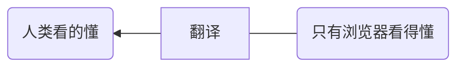

13.1 实战：原生爬虫项目

目录

[toc]

---

# 一、案例代码调整说明


1.原来的课程的熊猫TV网站不能爬取了，所以会换个新网站虎牙。其中。原理和方法都是一样的。


2.看完了，理解了，关键还是要会应用。
因为，再好的课程，也是带你入门，最重要的是自己以后能够灵活运用、解决问题。

3.本章的爬虫，非完整爬虫，只是功能简易的小案例，且没有使用任何框架。

因为完整的爬虫是很复杂的，复杂之处并不在于写法复杂，而是因为有多种多样的辅助功能，例如反爬机制、自动登录、代理IP。

尽管爬虫有简单复杂之分，但其本质都是：对HTML文件进行文本的分析，提取想要的信息。

4.该实战项目的目的有三个：
- 巩固以前所学的知识
- 合理的编码规范
- 熟悉爬虫原理

以下是原课程的知识体系。

# 二、前奏：爬取目的与分析网页结构

**1.爬取目的**
虎牙网站中，某一款游戏下各个主播的人气排行。

**2.分析网页结构**

（1）在将网页中想要的数据，抓取到自己的程序中之前，必须了解下网页的显示原理？
之所以网页显示排版规整的图片文字，是因为服务器给了一段HTML格式的信息。
谷歌浏览器，快捷键F12，查看网页的HTML信息。


（2）如何理解左右两边的关系？




（3）如何快速找到做左边的“观看人数”在HTML中的对应信息？
点击右边的左上角的箭头，鼠标悬停左边的“观看人数”，即可快速找到。

（4）如何提取信息？
系统内置的字符串函数，力不从心。所以用正则表达式。

>七月老师：
依靠爬虫，建立的产品有：搜索引擎、今日头条等等。


# 三、编写爬虫的整体思路

**1.爬虫前奏**
**（1）明确目的**
虎牙网站中，某一款游戏下各个主播的人气排行
**（2）找到数据对应的网页**


**（3）分析网页结构，找到数据所在的标签位置**


**2.正式编码**

模拟HTTP请求，向服务器发送这个请求，获取到服务器返回给我们的HTML。
然后，用正则表达式，提取我们的数据。
最后，处理数据。

# 四、正式编写

## 4.1 模拟HTTP请求，发送至服务器

如何模拟HTTP请求向服务器发送这个请求，获取到服务器返回给我们的HTML？

```py
from urllib import request     #从内置模块urllib中，导入对象request

class Spider():
    url = 'https://www.huya.com/g/lol'
    def __fetch_contents(self):
        r = request.urlopen(Spider.url)     #通过对象request，调用下面方法urlopen()，来接受网址
        htmls = r.read()                  #通过read()函数，读取类变量

    def go(self):                   #主方法、入口方法
        self.__fetch_contents()    #将拿回内容函数放入主方法，集中调用

spider = Spider()       #类的实例化
spider.go()             #通过实例对象spider，调用实例方法
```

## 4.2 调试工具

**1.调试重要性**
代码出现bug，但又找不到问题在什么地方。此时，第一件应该做的事情：断点调试。

这是每个开发者必备的技能，应足够重视。

对于复杂项目，print()不好用。因为print只能看到一个结果，项目多了就要加很多的print，而且，过程中的变量是无法看到的。

>七月老师：
学习一门课，可能没那么重要。但是，通过学习掌握调试，你会逐渐培养起自己独立思考、解决问题的能力。后者终生受益。


**2.调试的正确姿势**

之前在下方的命令行中的`python c8.py`，只是运行代码，不是调试。

调试快捷键：

```py
F5  ：启动调式/断点之间调试
F10 ：单步调试             #一次只执行一行
F11 ：进入函数内部
```
断点调试最重要的意义：鼠标于变量上悬停，可以查看变量状态。

小技巧：
调试的黄色进度箭头，如果跳出了目标变量的作用域，就无法查看其状态。
所以，可以加个`a = 1`并标上断点，即可加以解决。

## 4.3 调试变量HTML，字节码变str型

通过上述讲到的调试技巧，悬停查看变量可知：
`htmls = r.read()`得到的是字节码的HTML。那么，如何将其转换成字符串类型的HTML文本呢？

用`str()`内置函数

```py
from urllib import request     

class Spider():
    url = 'https://www.huya.com/g/lol'
    def __fetch_contents(self):
        r = request.urlopen(Spider.url)     
        htmls = r.read()              #字节码形式的HTML          
        htmls = str(htmls,encoding = 'utf-8')    #指定字符串的编码格式

    def go(self):                   #主方法、入口方法
        self.__fetch_contents()

spider = Spider()       
spider.go()             
```

## 4.4 正则分析HTML

**1.定义正则分析函数`__analysis()`**
用于对HTML文本的正则分析，通过规则匹配，找到想要的所有主播姓名和观看人数数据。

```py
from urllib import request     

class Spider():
    url = 'https://www.huya.com/g/lol'
    def __fetch_contents(self):
        r = request.urlopen(Spider.url)     
        htmls = r.read()                  
        htmls = str(htmls,encoding = 'utf-8')    

    def __analysis(self,htmls):     #定义正则分析函数
        pass

    def go(self):           
        htmls = self.__fetch_contents()
        self.__analysis(htmls)       #将正则分析函数放入主方法，集中调用

spider = Spider()       
spider.go() 
```

**2.HTML定位标签**
这是爬虫里面最重要的知识点。
寻找一个标签、标识符，以定位到要抓取的信息。

**（1）寻找原因**
常量有定位的边界作用，可以缩小寻找范围

**（2）寻找原则**
1.唯一性

2.最接近目标数据的标签
不能离得太远

3.闭合性
首位平级闭合，有利于提取中间内容

**（3）多数据的寻找**


不推荐对`nickname`和`number`分别分析，分别找定位标签。因为两个数据是一一对应的，即使后期排序也是绑定一起。
应该将其当作一组数据，视为一个整体，在组外统一找个定位标签。
最好是父级的标签。

**（4）标签层级关系**
由上述原则和特点，可找标签如下：


其层级关系：


本网站编写较规范，如上所述，三级文档，提取2次。
如果有些网站编写复杂、不规范，有可能是提取3~4次。
但，提取的原理是一样的。
本质就是个数据精细化的过程。


上面的导图，是其中一个主播的标签关系。实际上，某一款游戏下面，有很多的主播。即：


**3.编写正则表达式**
这是爬虫里面最重要的知识点。

**（1）编写一级的匹配规则**

```py
from urllib import request     

class Spider():
    url = 'https://www.huya.com/g/lol'   
    list_pattern = '<li class="game-live-item" data-gid="1" data-lp="[\d]*">([\s\S]*?)</li>'     
                         #一级的匹配规则
                         #其中，这里的[\d]*是指代原HTML中一串数字

    def __fetch_contents(self):
        r = request.urlopen(Spider.url)     
        htmls = r.read()                  
        htmls = str(htmls,encoding = 'utf-8')   

    def __analysis(self,htmls):    
        pass

    def go(self):           
        htmls = self.__fetch_contents()
        self.__analysis(htmls)     

spider = Spider()       
spider.go() 
```
其中：
（1）单双引号的特性
最外面的单引号`''`，表示python中的字符串
里面的双引号`""`，表示要匹配内容的字符串，必须与原HTML完全一样
所以，上述的引号，不能调换位置。

（2）正则表达式中规则的写法：


```py
[]    #表示里面的元字符是或关系    #见第7章：找出中间值是c或f的单词，'a[cf]c'
[\s\S]       #通过互补的概括字符集，表示囊括所有数据类型一个元素
[\s\S]*      # 星号*，表示重复前面的一个字符，0次或无限多次
[\s\S]*?     #关闭贪婪模式，遇到第一个</li>即停止
([\s\S]*?)    #小括号()，表示用组的概念提取中间内容，将两边的定位标签去掉
```

**（2）一次匹配**

将上述一级的匹配规则，传送到正则分析函数中，进行一次匹配。

```py
from urllib import request   
import re  

class Spider():
    url = 'https://www.huya.com/g/lol'    
    list_pattern = '<li class="game-live-item" data-gid="1" data-lp="[\d]*">([\s\S]*?)</li>'     
                # 正则的匹配规则太长了，所以以变量形式，传参到下面re.foundall函数中
    def __fetch_contents(self):
        r = request.urlopen(Spider.url)     
        htmls = r.read()                  
        htmls = str(htmls,encoding = 'utf-8') 
        return htmls  

    def __analysis(self,htmls):    
        list_html = re.findall(Spider.list_pattern,htmls)    #一级的正则寻找
                       #上面的一级匹配规则,以变量的形式，传了进来
        print(list_html[0])     #通过下标索引，查看其中一个变量的状态
        a = 1        #此处多写一行，用以调试查看上一行的结果


    def go(self):           
        htmls = self.__fetch_contents()
        self.__analysis(htmls)     

spider = Spider()       
spider.go() 

-->
<a href="https://www.huya.com/gushouyu" class="video-info clickstat" target="_blank" data-eid="" data-edesc=""><em class="tag tag-recommend">大神推荐</em><div class="item-mask"></div><i class="btn-link__hover_i"></i><p class="tag-right"><em class="tag-blue">蓝光<!-- -->8M</em></p></a><a href="https://www.huya.com/gushouyu" class="title" target="_blank" title="重回前十：打字骂人送六十万！发飙把把C"> 
重回前十：打字骂人送六十万！发飙把把C</a><span class="txt"><span class="avatar fl"><i class="nick" title="爱拍-古手羽">爱拍-古手羽</i></span><span class="num"><i class="num-icon"></i><i class="js-num">220.5万</i></span></span>
          #结果确实包含名字与观看人数两个目标数据        
```

接下来，就是根据匹配的结果，继续做正则二次匹配。

**（3）二次匹配**

编写二级的匹配规则，编写二级的正则寻找


```py
from urllib import request   
import re  

class Spider():
    url = 'https://www.huya.com/g/lol'    #虎牙网站
    list_pattern = '<li class="game-live-item" data-gid="1" data-lp="[\d]*">([\s\S]*?)</li>'     
    name_pattern = '<i class="nick" title="[\s\S]*?">([\s\S]*?)</i>'          
    number_pattern = '<i class="js-num">([\s\S]*?)</i>'
                                    #二级的匹配规则的写法，与一级几乎相同
                         
    def __fetch_contents(self):
        r = request.urlopen(Spider.url)     
        htmls = r.read()                  
        htmls = str(htmls,encoding = 'utf-8') 
        return htmls  

    def __analysis(self,htmls):     
        list_html = re.findall(Spider.list_pattern,htmls)

        anchors = []       #二级的正则寻找
        for html in list_html:   #用for in 循环，遍历总列表
            name = re.findall(Spider.name_pattern,html)    #这里的html是大列表中的一个小字典
            number = re.findall(spider.number_pattern,html)

            anchor = {'name':name,'number':number}  #将name和number拼成一个字典，叫anchor
            anchors.append(anchor)   #在列表中，添加元素的方法，是用.append()内置函数
            print(anchors[0])
            a = 1        #调试查看上一行结果

    def go(self):           
        htmls = self.__fetch_contents()
        self.__analysis(htmls)     

spider = Spider()       
spider.go() 

-->
{'name': ['爱拍-古手羽'], 'number': ['209.3万']}
```
以上是正则分析全过程，获取到了主播名字与观看人数。

## 4.5 精炼数据

爬虫中比较重要的环节。

目的：
- 将目标数据中，前面的空格、换行符等去掉
- 字典中的value是列表形式，为方便比较，将其转换成单一的字符串类型

```py
from urllib import request   
import re  

class Spider():
    url = 'https://www.huya.com/g/lol'   
    list_pattern = '<li class="game-live-item" data-gid="1" data-lp="[\d]*">([\s\S]*?)</li>'     
    name_pattern = '<i class="nick" title="[\s\S]*?">([\s\S]*?)</i>'          
    number_pattern = '<i class="js-num">([\s\S]*?)</i>'
                                    
                         
    def __fetch_contents(self):
        r = request.urlopen(Spider.url)     
        htmls = r.read()                  
        htmls = str(htmls,encoding = 'utf-8') 
        return htmls  

    def __analysis(self,htmls):       
        list_html = re.findall(Spider.list_pattern,htmls)
        anchors = []
        for html in list_html:   
            name = re.findall(Spider.name_pattern,html)  
            number = re.findall(spider.number_pattern,html)
            anchor = {'name':name,'number':number}  
            anchors.append(anchor)  
        return anchors  

    def __refine(self,anchors):        #精炼数据
        l = lambda anchor:{            
            'name':anchor['name'][0].strip(),  #用内置函数strip来去除字符串内前后的换行符、空格
            'number':anchor['number'][0]
            }   
    
        return map(l,anchors)   #用map进行lambda表达式的调用   #这里的结果是个map对象
                

    def go(self):           
        htmls = self.__fetch_contents()
        anchors = self.__analysis(htmls)     
        anchors = list(self.__refine(anchors))    #将精炼数据函数放入主方法，集中调用
                  #用list()函数，将map对象，转换成列表形式    
                  #传入该函数里面的参数，是上一级函数的结果
        print(anchors[0:2])

spider = Spider()       
spider.go() 

-->
[{'name': '爱拍-古手羽', 'number': '229.4万'}, {'name': '神超', 'number': '215.8万'}]
```

其中，重点分析下lambda表达式：

```py
anchor['name']      #通过键访问值，拿到的是列表
anchor['name'][0]       #列表中只有一个元素，通过下标索引[0]即可拿到，并是str
anchor['name'][0].strip()
```

**对比：**

||正则分析HTML结构|精炼数据|
|---|---|---|
||主要是分析HTML结构|已获得数据，但不规范，进一步规范下格式|
||比较粗糙|比较精炼|
|结果|`{'name': ['n\   爱拍-古手羽'], 'number': ['209.3万']}`|`{'name': '爱拍-古手羽', 'number': '229.4万'}`|


##实战：原生爬虫项目之二

###目录

- 案例代码调整说明
- 前奏：爬取目的与分析网页结构
- 编写爬虫的整体思路
- 正式编写
  - 模拟HTTP请求，发送至服务器
  - 调试工具
  - 调试变量HTML，字节码变str型
  - 正则分析HTML
  - 精炼数据
  - **业务处理：sorted排序**
- **写函数的技巧分享** 

---


## 4.6 业务处理：sorted排序

以后，就与爬虫没什么关系了，主要是跟业务紧密挂钩。

能够进行排序、比较大小的数据，只能是观看人数。
**1.目的**

- 把人数从字典中取出来；
- 将取出来的数字字符串文本，转换成数字的数据类型。


```py
from urllib import request   
import re  

class Spider():
    url = 'https://www.huya.com/g/lol'    
    list_pattern = '<li class="game-live-item" data-gid="1" data-lp="[\d]*">([\s\S]*?)</li>'     
    name_pattern = '<i class="nick" title="[\s\S]*?">([\s\S]*?)</i>'          
    number_pattern = '<i class="js-num">([\s\S]*?)</i>'
                                    
                         
    def __fetch_contents(self):
        r = request.urlopen(Spider.url)     
        htmls = r.read()                  
        htmls = str(htmls,encoding = 'utf-8') 
        return htmls  

    def __analysis(self,htmls):          
        list_html = re.findall(Spider.list_pattern,htmls)
        anchors = []
        for html in list_html:   
            name = re.findall(Spider.name_pattern,html)  
            number = re.findall(spider.number_pattern,html)
            anchor = {'name':name,'number':number}  
            anchors.append(anchor)  
        return anchors  

    def __refine(self,anchors):         
        l = lambda anchor:{            
            'name':anchor['name'][0].strip(),  
            'number':anchor['number'][0]
            }   
    
        return map(l,anchors)  

    def __sorted(self,anchors):           #排序函数
        anchors = sorted(anchors,key = self.__sort_seed)     #系统内置函数sorted，提供排序功能 
             #anchors：表示要进行排序的字典
             # key可以接受一个函数
        return anchors

    def __sort_seed(self,anchor):    #定义种子函数，以指定字典中哪个元素来比较大小
            #接受一个参数anchor，它是anchors中的一个单元字典
        return anchor['number']       #上面sorted函数，指定的比较对象是观看人数

    def __show(self,anchors):
        for anchor in anchors:
            print(anchor['name']+'------'+anchor['number'])

    def go(self):           
        htmls = self.__fetch_contents()
        anchors = self.__analysis(htmls)     
        anchors = list(self.__refine(anchors))   
        anchors = self.__sorted(anchors)     #将排序函数放入主方法，集中调用
        self.__show(anchors)

spider = Spider()       
spider.go() 

-->
小战------100.2万      #结果虽有，但升序排列，方向反了
黑店百地------116.2万
浪D------117.8万
陆雪琪------121.7万
骚男------136.2万
英雄联盟赛事------158.5万
岁月-搁浅------16.5万
Ning------181.5万
kRYST4L------198.2万
二兮------21.0万
凉艾------21.3万
瓜皮诺【919】------21.3万
PM-姚夜残------22.0万
曙望丶十三------22.2万
```

**2.更换排序顺序**


```py
...
    def __sorted(self,anchors):
        anchors = sorted(anchors,key = self.__sort_seed,reverse = True)    
                                      #将reverse改为True
            
        return anchors

    def __sort_seed(self,anchor):  
        return anchor['number']      

-->
盛世-叽歪鬼------99.8万          #虽成了降序
你的声优倩【招收主播】------99.1万
小绒尾------9.5万               #但仍不对。原因是：sorted里面，返回的是str，不是数字
曙望-臭臭没吃饱------85.3万      #因为，如果是str，比较的只是一个一个数字，非数值比较
陆雪琪------84.8万
黑店百地------82.6万
曙望-汉堡------82.2万
Zz1tai姿态------74.8万
盛世-纪小鹿【526】------68.6万
温稚------54.8万
```

**3.应该将观看人数，全部换算成数字。依靠数字的数值大小，来排序**


```py
from urllib import request   
import re  

class Spider():
    url = 'https://www.huya.com/g/lol'   
    list_pattern = '<li class="game-live-item" data-gid="1" data-lp="[\d]*">([\s\S]*?)</li>'     
    name_pattern = '<i class="nick" title="[\s\S]*?">([\s\S]*?)</i>'          
    number_pattern = '<i class="js-num">([\s\S]*?)</i>'
                                    
                         
    def __fetch_contents(self):
        r = request.urlopen(Spider.url)     
        htmls = r.read()                  
        htmls = str(htmls,encoding = 'utf-8') 
        return htmls  

    def __analysis(self,htmls):          
        list_html = re.findall(Spider.list_pattern,htmls)
        anchors = []
        for html in list_html:   
            name = re.findall(Spider.name_pattern,html)  
            number = re.findall(spider.number_pattern,html)
            anchor = {'name':name,'number':number}  
            anchors.append(anchor)  
        return anchors  

    def __refine(self,anchors):        
        l = lambda anchor:{            
            'name':anchor['name'][0].strip(),  
            'number':anchor['number'][0]
            }   
    
        return map(l,anchors)  

    def __sort(self,anchors):
        anchors = sorted(anchors,key = self.__sort_seed,reverse = True)    
        return anchors

    def __sort_seed(self,anchor):           #⭐注意！下面是\d，不是d\，否则会报错！
        r = re.findall('\d*',anchor['number'])     #将数字提取出来了。但此时的r，仍是str文本
        number = float(r[0])      #将str的数字，转换成数字类型。此时不能是int()，因为会涉及小数
        if '万' in anchor['number']:
            number *= 10000           #如果有单位万，就要乘以10000
        return number       

    def __show(self,anchors):
        for anchor in anchors:
            print(anchor['name']+'------'+anchor['number'])

    def go(self):           
        htmls = self.__fetch_contents()
        anchors = self.__analysis(htmls)     
        anchors = list(self.__refine(anchors))   
        anchors = self.__sort(anchors)    #⭐注意！这里不是sorted()，而是sort()。前者与内置函数同名，会引发错误！
        self.__show(anchors)

spider = Spider()       
spider.go() 

-->
TheShy------383.1万
Zz1tai姿态------273.1万
V1ncent丶文森特------262.0万
kRYST4L------234.0万
雨初歇-北枫------182.3万
黑店百地------161.9万
浪D------138.9万
小战------137.2万
骚男------129.2万
...
```

sort排序，是个开放函数，让别人来决定到底用哪个内容进行排序。

>七月老师:
>搜索引擎解决问题，是最高效的。有人觉得，花钱买课不提问，是吃亏。其实，你提问了，才是吃亏。因为你错过了一次自我学习、自我成长的机会。


上面的不足，在于没有主播的排名序号12345。

**4.增加排名序号**

因为列表已经排序好了，所以主播的序号，其实就是列表元素的序号。


```py
from urllib import request   
import re  

class Spider():
    url = 'https://www.huya.com/g/lol'    
    list_pattern = '<li class="game-live-item" data-gid="1" data-lp="[\d]*">([\s\S]*?)</li>'     
    name_pattern = '<i class="nick" title="[\s\S]*?">([\s\S]*?)</i>'          
    number_pattern = '<i class="js-num">([\s\S]*?)</i>'
                                    
                         
    def __fetch_contents(self):
        r = request.urlopen(Spider.url)     
        htmls = r.read()                  
        htmls = str(htmls,encoding = 'utf-8') 
        return htmls  

    def __analysis(self,htmls):          
        list_html = re.findall(Spider.list_pattern,htmls)
        anchors = []
        for html in list_html:   
            name = re.findall(Spider.name_pattern,html)  
            number = re.findall(spider.number_pattern,html)
            anchor = {'name':name,'number':number}  
            anchors.append(anchor)  
        return anchors  

    def __refine(self,anchors):         
        l = lambda anchor:{            
            'name':anchor['name'][0].strip(),  
            'number':anchor['number'][0]
            }   
    
        return map(l,anchors)  

    def __sort(self,anchors):
        anchors = sorted(anchors,key = self.__sort_seed,reverse = True)    
        return anchors

    def __sort_seed(self,anchor):     
        r = re.findall('\d*',anchor['number'])     
        number = float(r[0])     
        if '万' in anchor['number']:
            number *= 10000          
        return number       
 
    def __show(self,anchors):            #排名函数
        for rank in range(0,len(anchors)):   #用for in range 来获取列表元素的各个序号
            print('rank  '+str(rank + 1)
            +' : '+anchors[rank]['name']   
            +' :     '+anchors[rank]['number'])
           #rank的起始值是0，所以要加上1     #str只能和str相加，不能是int
                                
    def go(self):    #总控方法很好，清晰展现了数据处理的每个关键过程。因为是平级、没有嵌套，所以自己好维护，别人也一目了然    
        htmls = self.__fetch_contents()      #获取页面
        anchors = self.__analysis(htmls)     #正则分析HTML
        anchors = list(self.__refine(anchors))    #精炼数据 
        anchors = self.__sort(anchors)     #排序
        self.__show(anchors)      #规范展示

spider = Spider()       
spider.go() 

-->
rank  1 : TheShy :     398.7万
rank  2 : Zz1tai姿态 :     292.5万
rank  3 : V1ncent丶文森特 :     252.8万
rank  4 : kRYST4L :     233.1万
rank  5 : 雨初歇-北枫 :     181.2万
rank  6 : 黑店百地 :     179.9万
rank  7 : 浪D :     165.4万
rank  8 : 芜湖神 :     141.9万
rank  9 : 骚男 :     141.4万
rank  10 : 小战 :     127.2万
```

>小技巧：在VSCode中，如何在很长的文件里，找到想要的函数呢？
>Ctrl + Shift + O，输入show，会快速跳转到该方法。

如果后续有处理，那就不是show方法了，那可能就是编写存取到数据库中的方法。


# 五、写函数的技巧分享

## 5.1 pyhton中的注释写法

**（1）块注释**

模块注释：多行字符串（str）形式，最高级

```py
'''
This is a module.

'''

from urllib import request

```

类注释：多行字符串形式

```py
class Spider():
    '''
    this is a class.
    '''
    url = 'https://www.huya.com/g/lol'
     
```

方法注释：多行字符串形式

```py
def __fetch_content(self):  
        '''
        this is a method.
        '''

```

**（2）单行代码注释**

既可以在单行代码的后面，也可以在上面（推荐），并空行。

```py
        
        r = request.urlopen(Spider.url)      #request对象下面，有个urlopen方法：接受抓取网页的url地址    #将类变量url传送到urlopen中来   #实例方法中读取类变量

        htmls = r.read()    #用read方法读取出html    #html是一些字节码bytes

```

或

```py
        #request对象下面，有个urlopen方法：接受抓取网页的url地址    #将类变量url传送到urlopen中来   #实例方法中读取类变量
        r = request.urlopen(Spider.url)   

        #用read方法读取出html    #html是一些字节码bytes
        htmls = r.read() 
```


## 5.2 代码格式的规范性

**(1)善用空行**
有意义的空行，会方便阅读。但勿滥用。

**（2）一个函数，建议小巧，勿写太多行**
优点：

- 会确保函数名就是函数功能的最好描述
- 体积小，越灵活，复用越方便。你如果写太多逻辑，几乎不能复用。

国外建议：8行左右。
七月老师建议：控制在10-20行


## 5.3 需求变更

1.虎牙网站属于模板化建站，想爬取虎牙网站下其他的游戏，如王者荣耀，只需要在代码里，改个网站即可。

2.如果不抓取虎牙，可能就要全改。即抵御业务需求变化的能力太差。
因为本项目的爬虫，只是实现了功能，并没有融入面向对象的思维。
大部分人就是这个写法，很糟糕。

>七月老师：
>课程git上有面向对象版本的爬虫，可下载学习。


## 5.4 关于中大型爬虫

**（1）爬虫框架**
本案例属于小型爬虫，没使用任何的库或框架。
如果，想要写中大型的爬虫，比如分布式、多线程的爬虫，那就可以使用以下库：

- BeautifulSoup
- Scrapy

上述两个爬虫框架，在小的、简单的爬虫项目中，没必要用。

>七月老师：
>个人习惯，能不用就不用，专注于业务处理、解决问题、
>不要为了学框架而学框架，非常耗时。

爬虫只是个过渡技术，非终极技术。真正重要、更有意义的是，是精炼数据、与业务结合处理。而不是，为了爬而爬。

当然，除了上述需求，还有爬虫效率、爬虫海量数据的存取等。

**（2）IP被封**
最有可能遇到的问题是，IP被封。因为你爬取的频率太高了。所以，建议将频率设小一点。
如果被封，那就要寻找这样一个代理IP库。

